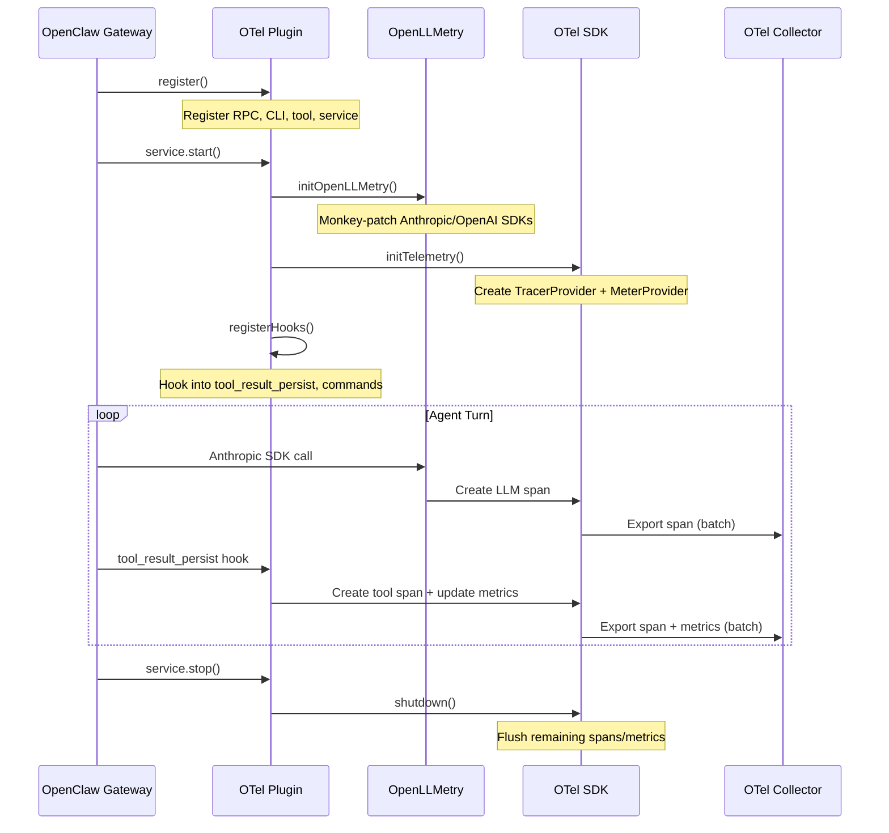

# Architecture

How the plugin integrates with OpenClaw and the OpenTelemetry ecosystem.

## Plugin Lifecycle



## Component Overview

### index.ts — Plugin Entry

The main plugin object registers everything with the OpenClaw plugin API:

- **Background service** — starts/stops OTel infrastructure
- **Gateway RPC** — `otel-observability.status` for remote status checks
- **CLI command** — `openclaw otel` for local status
- **Agent tool** — `otel_status` for in-conversation checks

### src/openllmetry.ts — LLM Auto-Instrumentation

Initializes the Traceloop Node.js SDK, which:

1. Discovers Anthropic and OpenAI SDK modules
2. Wraps their HTTP client methods with OTel span creation
3. Extracts model, tokens, latency, and content from requests/responses
4. Produces spans following [GenAI Semantic Conventions](https://opentelemetry.io/docs/specs/semconv/gen-ai/)

!!! important "Import Order"
    OpenLLMetry must initialize **before** the LLM SDKs make their first call. Since OpenClaw plugins load at gateway startup (before the agent loop runs), this is handled naturally.

### src/telemetry.ts — OTel SDK Setup

Creates and configures:

- **NodeTracerProvider** — manages trace span creation and export
- **MeterProvider** — manages metric instruments and periodic export
- **OTLP Exporters** — HTTP or gRPC exporters for traces and metrics
- **Instruments** — counters, histograms, and gauges for OpenClaw-specific metrics

### src/hooks.ts — Event Hooks

Registers OpenClaw hooks:

- **`tool_result_persist`** — fires synchronously before each tool result is saved. Creates a span and updates tool metrics. Returns `undefined` to keep the tool result unchanged.
- **Command events** — creates spans for `/new`, `/reset`, `/stop` commands
- **Gateway events** — creates a span for gateway startup

### src/config.ts — Configuration

Parses and validates plugin configuration with sensible defaults.

## Data Flow

### Traces

```
LLM SDK call
    ↓ (monkey-patched by OpenLLMetry)
OTel Span created with GenAI attributes
    ↓
BatchSpanProcessor (buffers spans)
    ↓ (on flush interval or batch size)
OTLPTraceExporter
    ↓ (HTTP POST or gRPC)
OTel Collector or Backend
```

### Metrics

```
Plugin hook fires (tool call, command, etc.)
    ↓
Counter.add() / Histogram.record()
    ↓
PeriodicExportingMetricReader (30s default)
    ↓
OTLPMetricExporter
    ↓ (HTTP POST or gRPC)
OTel Collector or Backend
```

## Resource Attributes

Every span, metric, and log record carries these resource attributes:

| Attribute | Value |
|-----------|-------|
| `service.name` | From `serviceName` config |
| `service.version` | Plugin version (`0.1.0`) |
| `openclaw.plugin` | `"otel-observability"` |
| *(custom)* | From `resourceAttributes` config |

## Security Considerations

### Content Privacy

By default, `captureContent: false` means:

- No prompt text is recorded in spans
- No completion text is recorded in spans
- Only metadata (model, tokens, latency) is captured

When enabled, full prompt/completion text is stored in your backend.

### Credential Handling

- Backend auth headers are stored in OpenClaw config (encrypted at rest if using OpenClaw's config encryption)
- When using the OTel Collector, credentials are on the collector only — the plugin sends to `localhost` unauthenticated

### Network

- OTLP/HTTP uses standard HTTPS when the endpoint is `https://`
- OTLP/gRPC supports TLS (configure on the collector side)
- For local collector setups, traffic is loopback only (`localhost`)

## Performance Impact

The plugin is designed to have minimal impact on agent performance:

- **Span creation** is fast (~microseconds) — no I/O during span creation
- **Metric updates** are atomic counter increments — no I/O
- **Export is batched** — spans/metrics are flushed periodically, not on every event
- **Hooks are synchronous but fast** — the `tool_result_persist` hook does minimal work
- **OpenLLMetry patching** adds ~1-2ms overhead per LLM call (negligible vs. LLM latency)
