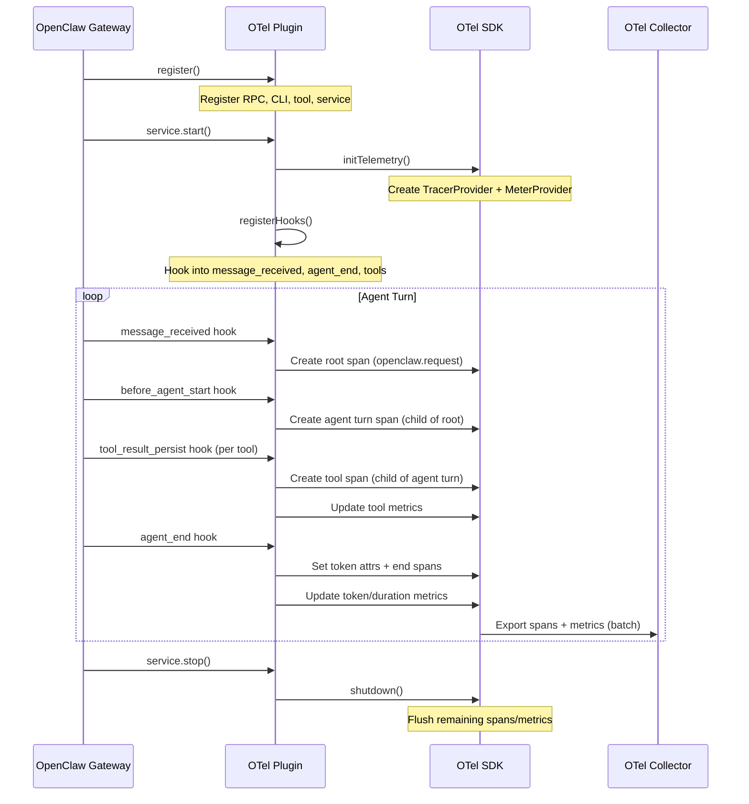

# Architecture

How the plugin integrates with OpenClaw and the OpenTelemetry ecosystem.

## Plugin Lifecycle



## Component Overview

### index.ts — Plugin Entry

The main plugin object registers everything with the OpenClaw plugin API:

- **Background service** — starts/stops OTel infrastructure
- **Gateway RPC** — `otel-observability.status` for remote status checks
- **CLI command** — `openclaw otel` for local status
- **Agent tool** — `otel_status` for in-conversation checks

### src/telemetry.ts — OTel SDK Setup

Creates and configures:

- **NodeTracerProvider** — manages trace span creation and export, registered globally
- **MeterProvider** — manages metric instruments and periodic export, registered globally via `metrics.setGlobalMeterProvider()`
- **OTLP Exporters** — HTTP or gRPC exporters for traces and metrics
- **Instruments** — counters, histograms, and gauges for OpenClaw-specific metrics

### src/hooks.ts — Event Hooks

The core instrumentation layer. Registers hooks on OpenClaw's two hook systems:

**Typed hooks** (via `api.on()`):

| Hook | Purpose |
|------|---------|
| `message_received` | Creates root span (`openclaw.request`), stores in session context map |
| `before_agent_start` | Creates child span (`openclaw.agent.turn`) under root |
| `tool_result_persist` | Creates tool spans under agent turn, records tool metrics |
| `agent_end` | Extracts token usage from messages, sets GenAI attributes, ends spans, records metrics |

**Event-stream hooks** (via `api.registerHook()`):

| Hook | Purpose |
|------|---------|
| `command:new/reset/stop` | Creates command lifecycle spans |
| `gateway:startup` | Records gateway startup event |

#### Trace Context Propagation

A `sessionContextMap` (keyed by `sessionKey`) stores the active root span and agent span contexts. This allows child spans (tools, agent turns) to be linked as children of the root request span, producing **connected traces** rather than isolated spans.

Stale contexts are cleaned up automatically after 5 minutes.

### src/openllmetry.ts — GenAI Status Check

Checks whether OTel GenAI auto-instrumentation is active via a `NODE_OPTIONS` preload script. Currently serves as a status reporter only — direct SDK auto-instrumentation is not possible from plugin code due to ESM/CJS module isolation. See [Limitations](limitations.md) for details.

### src/config.ts — Configuration

Parses and validates plugin configuration with sensible defaults.

## Data Flow

### Traces

```
OpenClaw hook fires (message_received, agent_end, etc.)
    ↓
Plugin creates OTel span with attributes
    ↓
BatchSpanProcessor (buffers spans)
    ↓ (on flush interval or batch size)
OTLPTraceExporter
    ↓ (HTTP POST or gRPC)
OTel Collector or Backend
```

### Metrics

```
Plugin hook fires (tool call, agent_end, etc.)
    ↓
Counter.add() / Histogram.record()
    ↓
PeriodicExportingMetricReader (30s default)
    ↓
OTLPMetricExporter
    ↓ (HTTP POST or gRPC)
OTel Collector or Backend
```

## Resource Attributes

Every span, metric, and log record carries these resource attributes:

| Attribute | Value |
|-----------|-------|
| `service.name` | From `serviceName` config (default: `openclaw-gateway`) |
| `service.version` | Plugin version (`0.1.0`) |
| `openclaw.plugin` | `"otel-observability"` |
| *(custom)* | From `resourceAttributes` config |

## Security Considerations

### Content Privacy

The plugin does **not** capture prompt or completion text. Only metadata is recorded:

- Model name and token counts
- Tool names and result sizes
- Span durations and status codes
- Session keys and channel identifiers

### Credential Handling

- Backend auth headers are stored in OpenClaw config
- When using the OTel Collector, credentials are on the collector only — the plugin sends to `localhost` unauthenticated

### Network

- OTLP/HTTP uses standard HTTPS when the endpoint is `https://`
- OTLP/gRPC supports TLS (configure on the collector side)
- For local collector setups, traffic is loopback only (`localhost`)

## Performance Impact

The plugin is designed to have minimal impact on agent performance:

- **Span creation** is fast (~microseconds) — no I/O during span creation
- **Metric updates** are atomic counter increments — no I/O
- **Export is batched** — spans/metrics are flushed periodically, not on every event
- **All hooks are wrapped in try/catch** — telemetry errors never break the main agent flow
