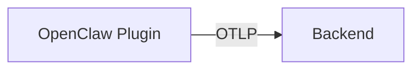
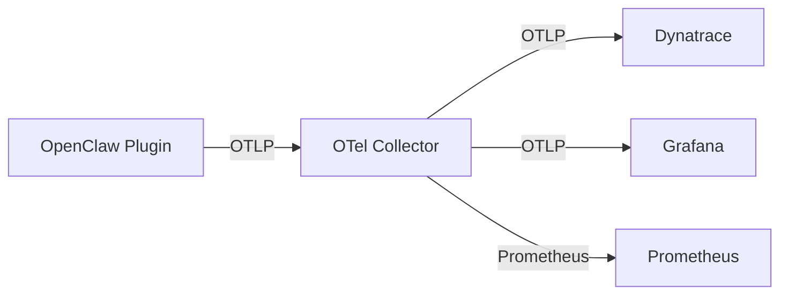

# Backends

The plugin exports telemetry via standard **OTLP** (OpenTelemetry Protocol), which means it works with any OpenTelemetry-compatible backend.

## Supported Backends

| Backend | Direct Export | Via Collector | Guide |
|---------|:---:|:---:|-------|
| **Dynatrace** | ✅ | ✅ | [Setup →](dynatrace.md) |
| **Grafana (Tempo + Mimir)** | ✅ | ✅ | [Setup →](grafana.md) |
| **Datadog** | ❌ | ✅ | [Generic →](generic-otlp.md) |
| **Honeycomb** | ✅ | ✅ | [Generic →](generic-otlp.md) |
| **New Relic** | ✅ | ✅ | [Generic →](generic-otlp.md) |
| **Splunk** | ❌ | ✅ | [Generic →](generic-otlp.md) |
| **Jaeger** | ✅ | ✅ | [Generic →](generic-otlp.md) |
| **SigNoz** | ✅ | ✅ | [Generic →](generic-otlp.md) |
| **OTel Collector** | — | — | [Setup →](otel-collector.md) |

## Direct Export vs. Collector

### Direct Export

- Simpler setup — no extra components
- Works well for single-backend setups
- Backend credentials are in the OpenClaw config

### Via OTel Collector (Recommended)

- **Batching & retry** — handles network hiccups gracefully
- **Processing** — filter, transform, and enrich data before export
- **Fan-out** — send to multiple backends simultaneously
- **Decoupled auth** — backend credentials stay on the collector, not in OpenClaw
- **Sampling** — reduce data volume for high-traffic agents

!!! tip "Recommendation"
    Use the OTel Collector in production. Use direct export for quick development testing.
