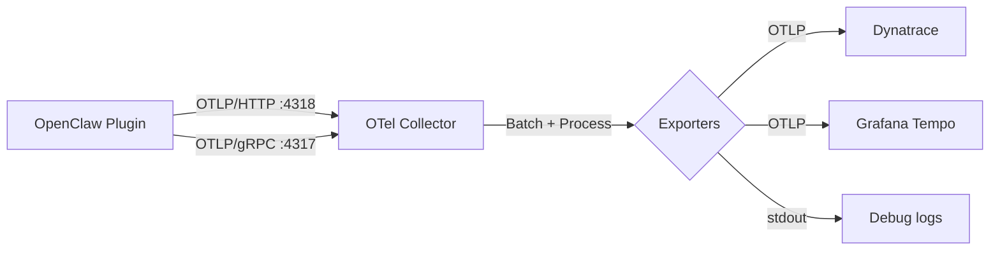

# OpenTelemetry Collector

The repo includes a pre-configured OTel Collector setup via Docker Compose. The collector acts as a pipeline between the plugin and your backend(s).

## Architecture



## Quick Start

```bash
# Set backend credentials
export DYNATRACE_ENDPOINT=https://<YOUR_ENV>.live.dynatrace.com/api/v2/otlp
export DYNATRACE_API_TOKEN=<YOUR_ACCESS_TOKEN>

# Start
docker compose up -d

# Check health
docker compose ps
docker compose logs -f otel-collector
```

## Collector Configuration

The configuration lives in `collector/otel-collector-config.yaml`.

### Default Pipeline

```yaml
service:
  pipelines:
    traces:
      receivers: [otlp]
      processors: [batch, resource]
      exporters: [otlphttp/dynatrace, debug]

    metrics:
      receivers: [otlp]
      processors: [batch, resource]
      exporters: [otlphttp/dynatrace, debug]

    logs:
      receivers: [otlp]
      processors: [batch, resource]
      exporters: [otlphttp/dynatrace, debug]
```

### Receivers

The collector accepts OTLP on both protocols:

- **gRPC** on port `4317`
- **HTTP** on port `4318`

### Processors

- **batch** — batches spans/metrics before export (reduces network calls)
- **resource** — adds resource attributes (e.g., `deployment.environment`)

### Exporters

- **otlphttp/dynatrace** — forwards to Dynatrace via OTLP/HTTP
- **debug** — prints to stdout (useful during setup)

## Customizing the Collector

### Add a Second Backend

Export to both Dynatrace and Grafana Tempo:

```yaml
exporters:
  otlphttp/dynatrace:
    endpoint: "${DYNATRACE_ENDPOINT}"
    headers:
      Authorization: "Api-Token ${DYNATRACE_API_TOKEN}"

  otlphttp/tempo:
    endpoint: "http://tempo:4318"

service:
  pipelines:
    traces:
      receivers: [otlp]
      processors: [batch]
      exporters: [otlphttp/dynatrace, otlphttp/tempo]
```

### Add Filtering

Drop noisy or unwanted spans:

```yaml
processors:
  filter:
    spans:
      exclude:
        match_type: regexp
        span_names:
          - "health.*"
          - "internal.*"

service:
  pipelines:
    traces:
      processors: [filter, batch]
```

### Add Sampling

Reduce trace volume (keep 10% of traces):

```yaml
processors:
  probabilistic_sampler:
    sampling_percentage: 10

service:
  pipelines:
    traces:
      processors: [probabilistic_sampler, batch]
```

### Add Span Enrichment

Add attributes to all spans:

```yaml
processors:
  attributes:
    actions:
      - key: environment
        value: production
        action: upsert
      - key: team
        value: ai-platform
        action: upsert
```

## Using a Custom Collector Image

The default Docker Compose uses `otel/opentelemetry-collector-contrib`, which includes all exporters. If you only need specific exporters, you can build a custom image:

```dockerfile
FROM otel/opentelemetry-collector-builder:latest as builder
COPY builder-config.yaml /build/config.yaml
RUN CGO_ENABLED=0 builder --config /build/config.yaml

FROM scratch
COPY --from=builder /build/otelcol /otelcol
ENTRYPOINT ["/otelcol"]
```

## Running Without Docker

Install the collector binary directly:

```bash
# Download
curl -L https://github.com/open-telemetry/opentelemetry-collector-releases/releases/download/v0.115.0/otelcol-contrib_0.115.0_linux_amd64.tar.gz | tar xz

# Run
./otelcol-contrib --config collector/otel-collector-config.yaml
```

## Monitoring the Collector

The collector exposes its own metrics on port `8888`:

```bash
# Prometheus metrics endpoint
curl http://localhost:8888/metrics
```

Key metrics to watch:

- `otelcol_exporter_sent_spans` — spans successfully exported
- `otelcol_exporter_send_failed_spans` — export failures
- `otelcol_receiver_accepted_spans` — spans received from the plugin
- `otelcol_processor_batch_batch_send_size` — batch sizes

## Troubleshooting

### Collector won't start

```bash
# Check logs
docker compose logs otel-collector

# Common issues:
# - Invalid YAML in config
# - Port already in use (4317/4318)
# - Environment variables not set
```

### No data flowing

1. Check plugin is sending: `openclaw otel` shows initialized
2. Check collector receives: Look for `otelcol_receiver_accepted_spans` > 0
3. Check collector exports: Look for `otelcol_exporter_sent_spans` > 0
4. Check for errors: `docker compose logs -f otel-collector | grep error`
