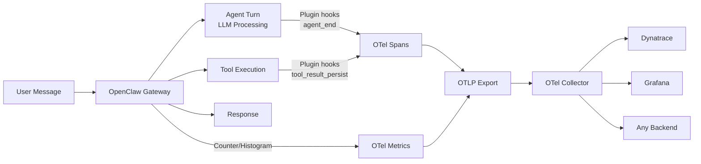

# 🔭 OpenClaw Observability Plugin

Full **OpenTelemetry** observability for [OpenClaw](https://github.com/openclaw/openclaw) AI agents — traces, metrics, and logs out of the box.

## Why?

Running an AI agent in production without observability is flying blind. You need to know:

- **How much are LLM calls costing?** → Token usage metrics by model
- **Why is the agent slow?** → Latency traces across agent turns and tool executions
- **What tools are being used?** → Tool call frequency and error rates
- **What's the agent actually doing?** → Full connected traces from message → agent turn → tools → response

This plugin gives you all of that with **zero code changes** to your OpenClaw setup.

## How It Works

### Hook-Based Instrumentation

The plugin hooks into OpenClaw's plugin API to capture telemetry at key points in the agent lifecycle:

| Hook | What It Captures |
|------|-----------------|
| `message_received` | Creates root span for the request, records message count |
| `before_agent_start` | Creates agent turn child span |
| `tool_result_persist` | Creates tool execution spans with result metadata |
| `agent_end` | Ends spans, extracts token usage from the LLM response |
| `gateway:startup` | Records gateway startup event |
| `command:new/reset/stop` | Records session lifecycle commands |

Every agent turn produces connected spans with token counts, model info, duration, and tool details — all linked under a single trace ID per request.

### Token Usage Extraction

Token counts are extracted from the `agent_end` event's message array. Each assistant message carries usage data (`input`, `output`, `cacheRead`, `cacheWrite`) which the plugin records as both:

- **Span attributes** — `gen_ai.usage.input_tokens`, `gen_ai.usage.output_tokens`, `gen_ai.usage.total_tokens`, `gen_ai.response.model`
- **OTel counter metrics** — `openclaw.llm.tokens.prompt`, `openclaw.llm.tokens.completion`, `openclaw.llm.tokens.total` (by model and agent)

## Features at a Glance

| Feature | Description |
|---------|-------------|
| 🔍 **Connected Traces** | Full request lifecycle: message → agent turn → tools, all linked |
| 📊 **Token Metrics** | Token usage counters by model (prompt, completion, cache, total) |
| 🛠️ **Tool Traces** | Individual spans for every tool call with result metadata |
| ⏱️ **Duration Histograms** | Agent turn and tool execution duration distributions |
| 📋 **Logs** | Structured gateway logs via OTel Collector filelog receiver |
| 🔒 **Privacy** | No prompt/completion content captured — only metadata |
| 🔌 **Any Backend** | OTLP export to Dynatrace, Grafana, Datadog, Honeycomb, and more |
| ⚡ **Zero Code** | Just install, configure, and restart — no code changes needed |
| 🐳 **Collector Included** | Docker Compose + config for local OTel Collector |

## Known Limitations

The plugin does **not** produce per-LLM-API-call spans (e.g., `anthropic.chat`). Token usage and model info are captured per **agent turn**, not per individual SDK call. See [Limitations](limitations.md) for the technical details and workarounds.

## Next Steps

- :material-rocket-launch: **[Getting Started](getting-started.md)**

    Install and configure the plugin in 5 minutes

- :material-cog: **[Configuration](configuration.md)**

    All configuration options explained

- :material-chart-bar: **[Metrics Reference](telemetry/metrics.md)**

    Complete list of exported metrics

- :material-transit-connection-variant: **[Backends](backends/index.md)**

    Connect to Dynatrace, Grafana, or any OTLP backend

- :material-alert-circle: **[Limitations](limitations.md)**

    Current constraints and planned improvements

