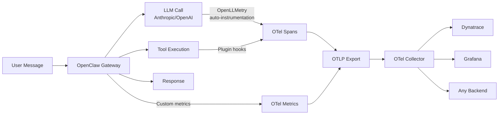

# 🔭 OpenClaw Observability Plugin

Full **OpenTelemetry** observability for [OpenClaw](https://github.com/openclaw/openclaw) AI agents — traces, metrics, and logs out of the box.

## Why?

Running an AI agent in production without observability is flying blind. You need to know:

- **How much are LLM calls costing?** → Token usage metrics
- **Why is the agent slow?** → Latency traces across LLM calls and tool executions
- **What tools are being used?** → Tool call frequency and error rates
- **What's the agent actually doing?** → Full distributed traces from message → LLM → tools → response

This plugin gives you all of that with **zero code changes** to your OpenClaw setup.

## How It Works

### Auto-Instrumentation (OpenLLMetry)

[OpenLLMetry](https://github.com/traceloop/openllmetry-js) by Traceloop automatically instruments LLM SDK calls using standard OpenTelemetry monkey-patching. When the plugin starts, it patches the Anthropic and OpenAI client libraries **before** they make any API calls.

This means every `messages.create()` call to Claude or `chat.completions.create()` call to GPT automatically produces a rich OpenTelemetry span with:

- Model name and parameters
- Token counts (prompt + completion)
- Request/response latency
- Error details and status codes
- Optionally: full prompt and completion text

### Custom Plugin Instrumentation

On top of OpenLLMetry's auto-instrumentation, the plugin adds:

- **Tool execution spans** via the `tool_result_persist` hook
- **Session command spans** for `/new`, `/reset`, `/stop`
- **Gateway lifecycle spans** for startup events
- **Custom metrics** for token usage, tool calls, active sessions, and more

## Features at a Glance

| Feature | Description |
|---------|-------------|
| 🔍 **LLM Traces** | Auto-instrumented Anthropic/OpenAI calls via OpenLLMetry |
| 🛠️ **Tool Traces** | Spans for every agent tool execution |
| 📊 **Metrics** | Token usage, latency histograms, error rates, active sessions |
| 📋 **Logs** | Structured gateway logs as OTel log records |
| 🔒 **Privacy** | Content capture off by default — opt-in for prompt/completion recording |
| 🔌 **Any Backend** | OTLP export to Dynatrace, Grafana, Datadog, Honeycomb, and more |
| ⚡ **Zero Code** | Just install, configure, and restart — no code changes needed |
| 🐳 **Collector Included** | Docker Compose + config for local OTel Collector |

## Next Steps

- :material-rocket-launch: **[Getting Started](getting-started.md)**

    Install and configure the plugin in 5 minutes

- :material-cog: **[Configuration](configuration.md)**

    All configuration options explained

- :material-chart-bar: **[Metrics Reference](telemetry/metrics.md)**

    Complete list of exported metrics

- :material-transit-connection-variant: **[Backends](backends/index.md)**

    Connect to Dynatrace, Grafana, or any OTLP backend

